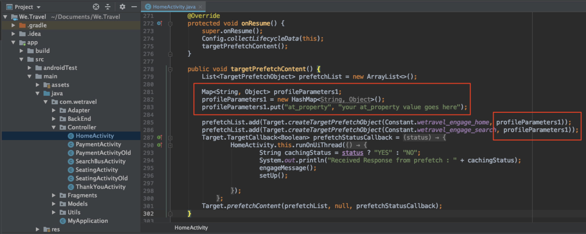

# Add Parameters to the Requests

In this lesson we will validate Adobe lifecycle metrics and add custom parameters to the prefetch request. The lifecycle metrics and custom parameters will be used for creating audiences that determine new and returning users. We will also enhance the third location request (found on the thank you screen) with parameters that will be used to determine the user's trip origin & destination so we can later serve an offer based on those parameters.

## Learning Objectives

At the end of this lesson, you will be able to:

* **Add and Validate the Adobe Lifecycle Metrics Request (used for creating audiences later)
* **Add Parameters to the Prefetch Request (used for creating audiences later)**
* **Add Parameters to the Live Location (used for creating audiences later)**
* **Validate the Parameters for Both Requests**

## Add the Lifecycle Parameters

The Config.collectLifecycleData request found in the onResume() function enables the [Adobe mobile lifecycle metrics](https://docs.adobe.com/content/help/en/mobile-services/android/metrics.html). This request adds parameters to location requests, including the prefetch request. We'll build our audience segments in the next lesson using data that the lifecycle request provides.

To enable lifecycle metrics & parameters, make sure the Config.collectLifecycleData is added to the onResume() function in your HomeActivity:


### Validate the Lifecycle Parameters for the Prefetch Request

Run the Emulator and use Logcat to validate the lifecycle parameters. Filter for "prefetch" to find the prefetch response and look for the new parameters:


## Add the at_property Parameter to the Prefetch Request

Adobe Target Properties are defined in the Target interface and are used to establish boundaries for personalizing apps and websites. The at_property parameter identifies the specific property where your offers & activities are accessed & maintained. We'll add this property to the prefetch and live location requests. You can retrieve your at_property value in the Target interface under Setup > Properties. Hover over the property, select the code snippet icon and copy the at_property value. Add it as a parameter for each location in the prefetch request like this:

Here is the updated code for the targetPrefetchContent() function:

```java
public void targetPrefetchContent() {
    List<TargetPrefetchObject> prefetchList = new ArrayList<>();

    Map<String, Object> profileParameters1;
    profileParameters1 = new HashMap<String, Object>();
    profileParameters1.put("at_property", "your at_property value goes here");

    prefetchList.add(Target.createTargetPrefetchObject(Constant.wetravel_engage_home, profileParameters1));
    prefetchList.add(Target.createTargetPrefetchObject(Constant.wetravel_engage_search, profileParameters1));
    Target.TargetCallback<Boolean> prefetchStatusCallback = new Target.TargetCallback<Boolean>() {
        @Override
        public void call(final Boolean status) {
            HomeActivity.this.runOnUiThread(new Runnable() {
                @Override
                public void run() {
                    String cachingStatus = status ? "YES" : "NO";
                    System.out.println("Received Response from prefetch : " + cachingStatus);
                    engageMessage();
                    setUp();

                }
            });
        }};
    Target.prefetchContent(prefetchList, null, prefetchStatusCallback);
}
```

### Note About Parameters

The method used in the example above is also used to add custom profile parameters and mbox parameters. Also, different parameters can be added to each location in the prefetch request. For example, you can create another Map called profileParameters2, put a new parameter in it, then set profileParameter1 with one location and profileParameter2 with another location in the createTargetPrefetchObject function).

## Validate the at_property Parameter in the Prefetch Request

Now run the emulator and use Logcat to verify that the at_parameter is showing on the prefetch request & response for both locations:


## Add Custom Parameters to the Live Location Request

The third location (wetravel_context_dest) was already loaded in real-time and validated in the previous lesson, so it's ready to display an offer. This location will display a relevant banner offer when a user books a trip. Before we move on to build the offer, we need the at_property and two custom mbox parameters for this request to identify the trip source and destination. Add the following parameters to the targetLoadRequest() function in the ThankYouActivity controller:

Here is the updated code for the targetLoadRequest() function:

```java
    public void targetLoadRequest(final ArrayList<Recommandation> recommandations) {

        Map<String, Object> mboxParams = new HashMap<>();
        mboxParams.put("at_property","add your at_property value here");
        mboxParams.put("locationSrc", (""+Utility.getInSharedPreference(ThankYouActivity.this,Constant.departure,"")));
        mboxParams.put("locationDest", (""+Utility.getInSharedPreference(ThankYouActivity.this,Constant.destination,"")));

        Target.loadRequest(Constant.wetravel_context_dest, "", null, null, mboxParams, new Target.TargetCallback<String>() {
            @Override
            public void call(final String response) {
            try {
                runOnUiThread(new Runnable() {
                    @Override
                    public void run() {
                        AppDialogs.dialogLoaderHide();
                        filterRecommendationBasedOnOffer(recommandations, response);
                        recommandationbAdapter.notifyDataSetChanged();
                    }
                });
            } catch (Exception e) {
                e.printStackTrace();
            }
            }
        });
        Target.clearPrefetchCache();
    }
```

### Validate the Custom Parameters in the Live Location Request

Run the emulator and open Logcat. Filter for one of the parameters to verify that the request contains the needed parameters:


Nice work! Now that parameters are in place, we're ready to use those parameters to create segments & offers in Adobe Target.

[NEXT : "Create Segments and Offers" >](create-segments-and-offers.md)
