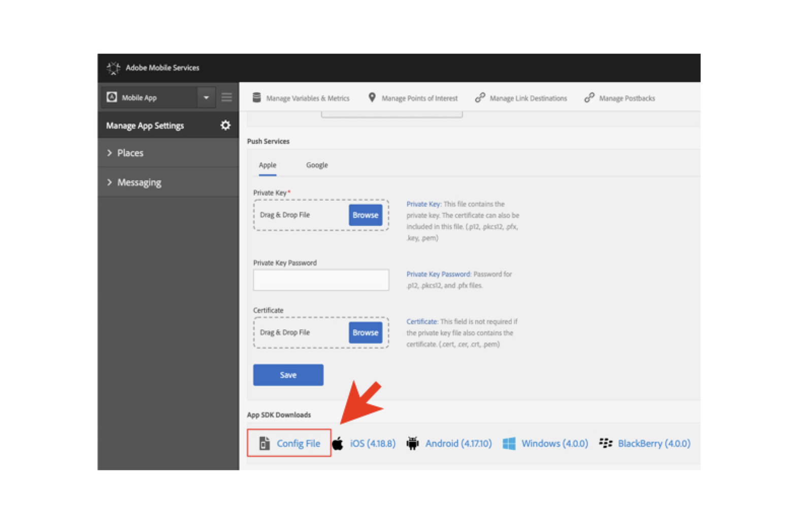
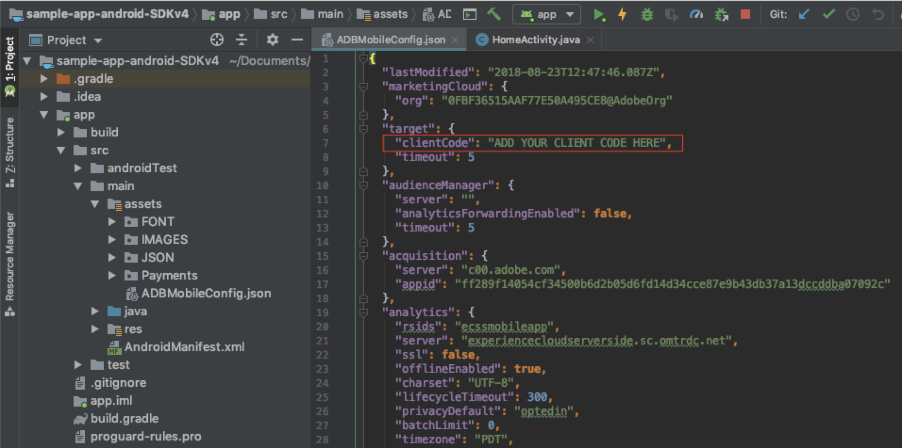
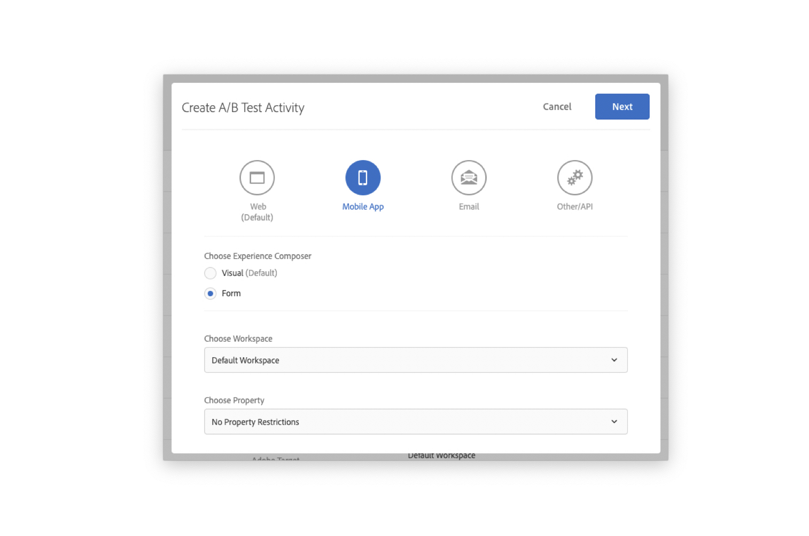
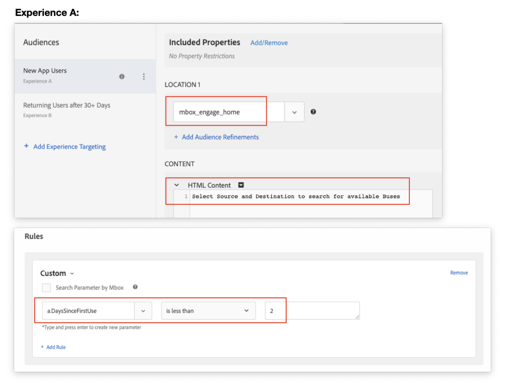
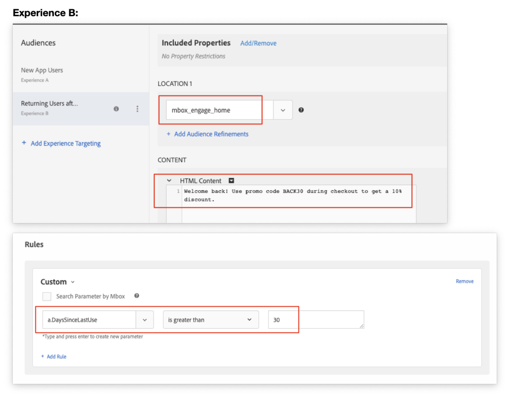
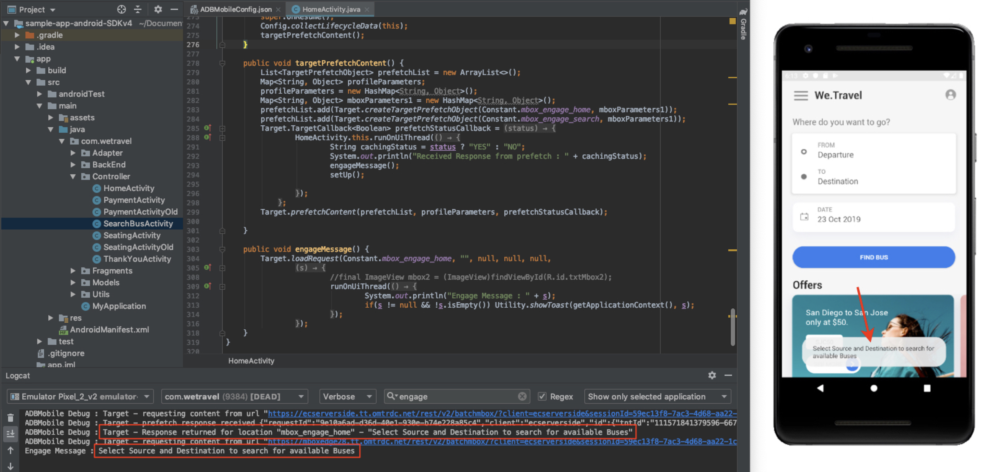

# Prefetched Mobile mBoxes

The Adobe Mobile Services SDK (v4) provides Adobe Target methods & functionality that enable you to personalize your app with different experiences for different users.

In this lesson, you will implement multiple mbox scenarios in the We.Travel demo app. Before you begin, be sure to [download and validate the We.Travel app](https://github.com/adobe-target/documentation/blob/mpc-docs/download-validate-and-update-the-sample-app.md).

## Learning Objectives

At the end of this lesson, you will be able to:

* **Prepare Your App for A/B Testing** 
* **Prefetch mBoxes in Your App**
* **Configure a Mobile App Target Activity**
* **Load and Display a Prefetched mBox**
* **Validate the Experience in Android Studio**

## Personalization Use Case : Engage New & Returning Users
Our first mBoxes on We.Travel will target two audiences: New users & returning users. New users will receive notifications to help guide their first bus searches. Returning users will receive a "welcome back" message.

We'll now configure the SDK settings, create the experiences in Target, prefetch them in the app's background, then load the mboxes on the screen at the appropriate time.

### 1) Configure SDK Settings
First, make sure the SDK is configured properly in Android Studio with your specific company settings:

* Log in to the Adobe Mobile Services interface:  https://mobilemarketing.adobe.com
* Add a new app (if not already done)
* Select the new app from the top left drop-down
* Select "Manage App Settings" (or gear icon)
* Scroll to the bottom and download the Config File:


Add the Config File (ADBMobileConfig.json) to your project assets folder (app > src > main > assets).

Now open the ADBMobileConfig.json file and make sure your "Client Code" is added. If it's not already added, you can find it in the Target interface under Setup > Implementation > Edit Settings (next to the Download at.js button).



### 2) Implement a Prefetch Request
A prefetch request uses the Android Mobile SDKs to fetch offer content as few times as possible by caching the server responses. Creating a prefetch request with an array of mboxes retrieves and caches the mboxes on the device for future use in the user session. Refer to the [prefetch documentation](https://docs.adobe.com/content/help/en/mobile-services/android/target-android/c-mob-target-prefetch-android.html) for more details on prefetch methods.

The Android Activity Controllers for We.Travel are located under app > main > java > com.wetravel > Controller. We'll start with HomeActivity, which is the Home Screen's source code. We'll add the following code blocks shown in red:


Scroll down to the end of the HomeActivity's code and add the code provided below after the setHeader() function:

```
@Override
protected void onResume() {
    super.onResume();
    Config.collectLifecycleData(this);
    targetPrefetchContent();
}

public void targetPrefetchContent() {
    List<TargetPrefetchObject> prefetchList = new ArrayList<>();
    Map<String, Object> profileParameters;
    profileParameters = new HashMap<String, Object>();
    Map<String, Object> mboxParameters1 = new HashMap<String, Object>();
    prefetchList.add(Target.createTargetPrefetchObject(Constant.mbox_engage_home, mboxParameters1));
    prefetchList.add(Target.createTargetPrefetchObject(Constant.mbox_engage_search, mboxParameters1));
    Target.TargetCallback<Boolean> prefetchStatusCallback = new Target.TargetCallback<Boolean>() {
        @Override
        public void call(final Boolean status) {
            HomeActivity.this.runOnUiThread(new Runnable() {
                @Override
                public void run() {
                    String cachingStatus = status ? "YES" : "NO";
                    System.out.println("Received Response from prefetch : " + cachingStatus);
                    engageMessage();
                    setUp();

                }
            });
        }};
    Target.prefetchContent(prefetchList, profileParameters, prefetchStatusCallback);

}

public void engageMessage() {
    Target.loadRequest(Constant.mbox_engage_home, "", null, null, null,
            new Target.TargetCallback<String>(){
                @Override
                public void call(final String s) {
                    runOnUiThread(new Runnable() {
                        @Override
                        public void run() {
                            System.out.println("Engage Message : " + s);
                            if(s != null && !s.isEmpty()) Utility.showToast(getApplicationContext(), s);
                        }
                    });
                }
            });
}
``` 

Code Explanation:

| Function | Description |
|--- |--- |
| Config.collectLifecycleData(this) | Enables collection of mobile lifecycle metrics  |
| targetPrefetchContent() | Retrieves and caches mboxes (multiple mboxes can be added via a Java List). The first time an mbox name is requested, the mbox will be created on the Target server. This code requests two mboxes: mbox_engage_home (displayed on the home screen) & mbox_engage_search (displayed on the search results screen). |
| engageMessage() | This custom function fires a Target.loadRequest which then loads the cached mbox content on the screen |

### 3) Validate the Initial mbox Calls
Fire up the Android Emulator. When the Home screen loads, both Target requests (targetPrefetchContent & loadRequest) should load.

With Logcat, filter for "engage" or "mbox" to see the mbox requests & responses.


* The prefetched mboxes response should read "prefetch response received". 
* The "mbox_engage_home" mbox response should read "Default content was returned" (since this is the first request to the server).

If you are not seeing success responses, verify settings in the ADBMobileConfig.json file and code syntax in the HomeActivity file.

### 4) Configure an Activity in Adobe Target
Now that the mboxes are requested, they will be available in Target. Log in to Target and create a new A/B Test for "Mobile App" with the Form composer. Choose your workspace & select "No Property Restrictions".

**Build Experience A (new users) for the Home Screen**

* Location 1:  select the mbox_engage_home mbox
* Content:  use HTML that reads "Select Source and Destination to search for available Buses".  This is the message that will be displayed to new users.
* Audience:  use a custom rule (a.DaysSinceLastUse < 2) 



**Build Experience B (returning users) for the Home Screen**

* Location 1:  select the mbox_engage_home mbox
* Content:  use an HTML welcome back message.  This is the message that will be displayed to returning users.
* Audience:  use a custom rule (a.DaysSinceLastUse > 30) 


Set the Activity to "Live" status.

### 5) Validate the new Activity in the App
Now that our activity is live, it's time to validate the mbox. Run the emulator and watch for the "toast" popup that shows the mbox content displayed briefly. 

Also, open Logcat & filter for "engage" to see responses. 

If no responses are received, review all the steps above.
