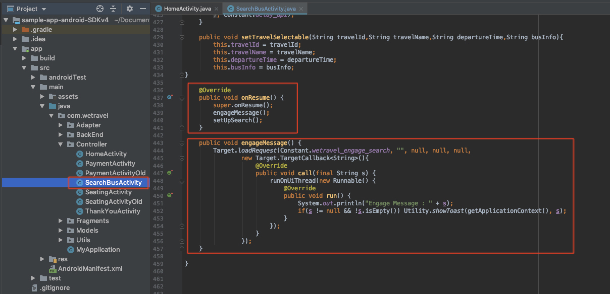
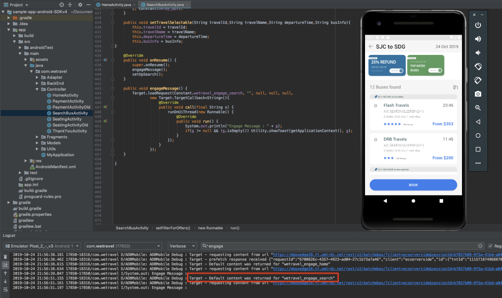

# Add Adobe Target Requests

The Adobe Mobile Services SDK (v4) provides Adobe Target methods & functionality that enable you to personalize your app with different experiences for different users.

In this lesson, you will prepare your app for personalization by implementing multiple Target requests in the We.Travel demo app. 

## Before You Begin

Be sure to [download and update the We.Travel app](download-and-update-the-sample-app.md).

## Learning Objectives

At the end of this lesson, you will be able to:

* **Prefetch Multiple Target Requests**
* **Load and Display a Prefetched Target Request**
* **Load and Display Target Requests in Real-Time (non-prefetched)**
* **Clear Prefetched Requests from Cache**
* **Validate Target Requests in Android Studio**

## Prefetch Target Requests
A prefetch request fetches offer content as minimal as possible by caching Adobe Target server responses. Creating a prefetch call with an array of Target requests retrieves and caches the requests on the device for future use in the user session. Refer to the [prefetch documentation](https://docs.adobe.com/content/help/en/mobile-services/android/target-android/c-mob-target-prefetch-android.html) for more details on prefetch methods.

### Add the Prefetch & 1st Load Request to the Home Screen
Our first scenario on We.Travel will prefetch two Target requests in one call. We'll start with the HomeActivity controller (the Home Screen's source code), which is located under app > main > java > com.wetravel > Controller. We'll add the 3 code blocks shown in red:


Scroll down to the end of the HomeActivity's code and add the code provided below after the setHeader() function:

```
@Override
protected void onResume() {
    super.onResume();
    Config.collectLifecycleData(this);
    targetPrefetchContent();
}

public void targetPrefetchContent() {
    List<TargetPrefetchObject> prefetchList = new ArrayList<>();
    prefetchList.add(Target.createTargetPrefetchObject(Constant.wetravel_engage_home, null));
    prefetchList.add(Target.createTargetPrefetchObject(Constant.wetravel_engage_search, null));
    Target.TargetCallback<Boolean> prefetchStatusCallback = new Target.TargetCallback<Boolean>() {
        @Override
        public void call(final Boolean status) {
            HomeActivity.this.runOnUiThread(new Runnable() {
                @Override
                public void run() {
                    String cachingStatus = status ? "YES" : "NO";
                    System.out.println("Received Response from prefetch : " + cachingStatus);
                    engageMessage();
                    setUp();

                }
            });
        }};
    Target.prefetchContent(prefetchList, null, prefetchStatusCallback);
}

public void engageMessage() {
    Target.loadRequest(Constant.wetravel_engage_home, "", null, null, null,
            new Target.TargetCallback<String>(){
                @Override
                public void call(final String s) {
                    runOnUiThread(new Runnable() {
                        @Override
                        public void run() {
                            System.out.println("Engage Message : " + s);
                            if(s != null && !s.isEmpty()) Utility.showToast(getApplicationContext(), s);
                        }
                    });
                }
            });
}
``` 

**Code Explanation:**

| Code | Description |
|--- |--- |
| Config.collectLifecycleData(this) | Enables collection of mobile lifecycle metrics  |
| targetPrefetchContent() | Retrieves and caches two Target requests. The first time a request is sent, the Target Server will create a location name which can be used in the Target interface. |
| Constant.wetravel\_engage\_home | Cached location placeholder which displays its content on the Home Screen (via the engageMessage() function) |
| Constant.wetravel\_engage\_search | Cached location placeholder which will be loaded & display its content on the Search Results Screen | 
| engageMessage() | This custom function fires a Target.loadRequest which loads & displays the cached request's content on the screen |
| setUp() | Renders the app's content after Target requests are called |

**A Note About Asyncronous vs. Syncronous :**  In this scenario, the Target requests run syncronously as blocking calls, just before the app's content renders. Note how setUp() is called after the Target requests. This can be beneficial in many scenarios because it ensures that Target content is available before the app's content is displayed. To make the requests load asyncronously (in the background), just call setUp() within the onCreate() function instead.

### Add the 2nd Load Request to the Search Results Screen
Now let's load the second request from cache on the Search Results Screen. We'll add the code blocks in red to the SearchBusActivity file: 
 


Scroll down to the end of the SearchBusActivity file and add the code below after the setTravelSelectable() function:

```
@Override
public void onResume() {
    super.onResume();
    engageMessage();
}

public void engageMessage() {
    Target.loadRequest(Constant.wetravel_engage_search, "", null, null, null,
            new Target.TargetCallback<String>(){
                @Override
                public void call(final String s) {
                    runOnUiThread(new Runnable() {
                        @Override
                        public void run() {
                            System.out.println("Engage Message : " + s);
                            if(s != null && !s.isEmpty()) Utility.showToast(getApplicationContext(), s);
                        }
                    });
                }
            });
}
``` 

### Validate the Requests on the Home Screen
Fire up the Android Emulator in Android Studio. When the Home screen loads, both Target requests (the prefetch & load request) should load. With Logcat, filter for "engage" to see the requests & responses:


* The prefetch response should read "prefetch response received". 
* The "wetravel\_engage\_home" response should read "Default content was returned for "wetravel\_engage_\home" (default content is returned since this is the first request to the server & there is no offer content configured yet).

If you are not seeing success responses, verify settings in the ADBMobileConfig.json file and code syntax in the HomeActivity file.

### Validate the Request on the Search Results Screen
With the Emulator still open, select a depature & destination and tap "Find Bus". Watch Logcat for the Target response:



* The "wetravel\_engage\_search" response should read "Default content was returned for "wetravel\_engage\_search" (default content is returned since this is the first request to the server & there is no offer content configured yet).

If you are not seeing success responses, verify settings in the ADBMobileConfig.json file and code syntax in the SearchBusActivity file.


## Load and Display Target Requests in Real-Time


## Clear Prefetched Requests from Cache


