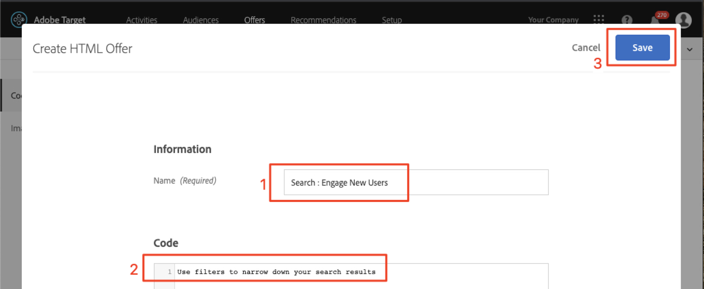
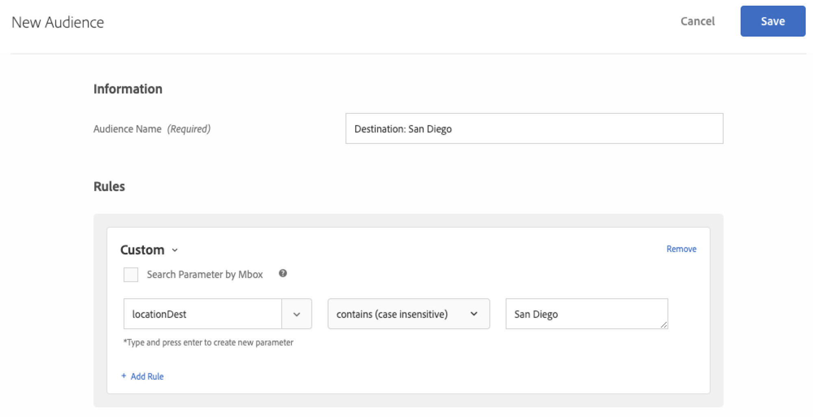

# Create Audiences and Offers in Adobe Target

In this lesson, we'll build audiences and offers in Adobe Target for the three locations we implemented in the previous lessons. These will be used to display personalized experiences in the next lesson.

## Learning Objectives

At the end of this lesson, you will be able to:

* **Create Audiences in Adobe Target**
* **Create Offers in Adobe Target for Each Location in your App**

This lesson will require access to Adobe Target. Before moving on through the next steps, ensure you have access to Adobe Target, which is accessed through the Adobe Experience Cloud here: [https://experience.adobe.com/](https://experience.adobe.com/). Contact your Adobe Administrator for access.

Select Adobe Target and you'll be logged in to the Target UI where you can create Audiences and Offers for this lesson. First, make sure that the correct Workspace is selected. A workspace is used to separate Target projects into groups so that projects can be categorized or separated for different users. Select the Workspace that you used in the previous lesson to copy the at_property value:

## Create Audiences for New and Returning Users

Adobe Target Audiences are used to identify specific groups of visitors. Offers can then be targeted to those specific groups. For the first two locations, we'll use a "New Users" audience and a "Returning Users" audience.

Messages for the first two locations will be displayed in the app as follows:

| Audience | Location | Message |
| --- | --- | --- |
| New Users | wetravel_engage_home | "Select your Origin & Destination to search for available bus routes" |
| New Users | wetravel_engage_search | "Use filters to narrow down your search results" |
| Returning Users | wetravel_engage_home | "Welcome back! Use promo code BACK30 during checkout to get a 10% discount." |
| Returning Users | wetravel_engage_search | default content |

The "wetravel_engage_home" and "wetravel_engage_search" locations are located on the home and search results screens. They will be used to help engage users to search for bus trips. We'll need audience segments built that target new and returning users so we can display relevant messages to users. Let's use the lifecycle metric "a.DaysSinceFirstUse" to build those audiences. 

>**Note about Lifecycle metrics:**
>All Lifecycle metrics and dimensions collected in the Target mobile SDK are prepended with "a" (a.DaysSinceFirstUse, a.DaySinceLastUse, etc.). These variables are available to use in Audiences.

### Create the New Users Audience

(1) Select Audiences
(2) Select Create Audience

(3) Enter "New Mobile App Users" as the audience name
(4) Select "Add Rule"
(5) Select a "Custom" rule

(6) Select a.Launches
(7) Select "is less than"
(8) Enter "5"
(9) Save the new audience

### Create the Returning Users Audience

Follow the same steps listed above to create an audience for users who return at 5 or more app launches.

(1) Name the audience "Returning Mobile App Users"
(2) Use "a.Launches is greater than or equal to 5" as the custom rule
(3) Save the new audience

## Create Offers for New and Returning Users

We'll create HTML offers to display these messages. As a reminder, offers are snippets of code/content, defined in the Target user interface (or with API), which are delivered in the Target response. In mobile apps, JSON offers are common. For this demo, we'll be using HTML offers, which display in plain text in the app.

### Create the Home Screen New Users Offer

First, let's create offers for the messages to New Users. In the Target interface, select Offers > Create HTML Offer:

(1) Select Offers
(2) Select Create
(3) Select "HTML Offer"

(4) Name the offer "Home : Engage New Users"
(5) Enter "Select Source and Destination to search for available buses" as the HTML code
(6) Save the new offer

### Create the Search Screen New Users Offer

Repeat the steps above to create a new HTML offer for the Search screen:

(1) Name the offer "Search : Engage New Users"
(2) Enter "Use filters to narrow down your search results" as the HTML code
(3) Save the new offer

### Create the Home Screen Returning Users Offer

Now let's create the Home HTML offer for Returning Users:

(1) Name the offer "Home : Returning Users"
(2) Enter "Welcome back! Use promo code BACK30 during checkout to get a 10% discount." as the HTML code
(3) Save the new offer

The Search Screen offer for Returning Users will return default content (which is set to nothing), so there is no need to create an offer for Returning Users for the Search Screen.

## Create Audiences for Users That Book Specific Destinations

For this demo app, we'll focus on displaying offers for two trip destinations - San Diego and Los Angeles. The messages will be returned to the app as follows:

| Audience | Location | Message |
| --- | --- | --- |
| Destination: San Diego | wetravel_context_dest | "DJ" |
| Destination: Los Angeles | wetravel_context_dest | "Universal" |

When the "Universal" value is returned to the app, a banner for Universal Studios will display. When "DJ" is returned, a banner for "Rock Night with DJ SAM" will display. The idea is to display relevant recommendations based on destination after a booking. Let's first create two custom audiences in the Target interface:

### Create the "Destination : San Diego" Audience

(1) Name the audience "Destination : San Diego"
(2) Use a custom rule with this definition: "locationDest contains San Diego"
(3) Save the new audience

### Create the "Destination : Los Angeles" Audience

(1) Name the audience "Destination : Los Angeles"
(2) Use a custom rule with this definition: "locationDest contains Los Angeles"
(3) Save the new audience

## Create Offers for Destination Promotions

Now we'll create HTML offers for these messages.

### Create the San Diego Offer

(1) Name the offer "Promotion for San Diego"
(2) Enter "DJ" as the HTML code
(3) Save the new offer

### Create the Los Angeles Offer

(1) Name the offer "Promotion for Los Angeles"
(2) Enter "Universal" as the HTML code
(3) Save the new offer

>Note: Our demo app contains custom logic that captures the destination value from the user's input. The logic then checks that value against the Target response and determines which banner to display. You may need to use similar logic in your own app in specific user scenarios.

## Conclusion

Now that Audiences and Offers are in place, we're ready to view the final experience. In the next lesson, we'll build activities and walk through the experience in the app.

**[NEXT : "Personalize Layouts" >](personalize-layouts.md)**
