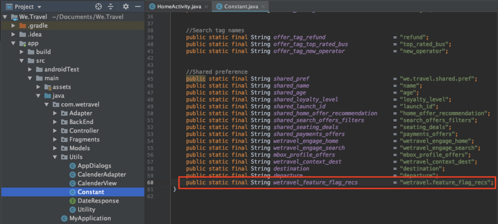

# Feature Flagging

Mobile app product owners need the flexibility to roll out new features in their app without having to invest in multiple app releases. They may also want to roll out features gradually to a percentage of the user base, to test effectiveness. Adobe Target can be used to experiment with UX features like color, copy, buttons, text & images and provide those features to specific audiences.

In this lesson, we'll create a "feature flag" offer which can be used as a trigger to enable specific app features.

## Learning Objectives

At the end of this lesson, you will be able to:

* **Add a new location to the batch prefetch request**
* **Create a Target activity with an offer that will be used as a feature flag**
* **Load and validate the feature flag offer in your app**

## Add a New Location to the Prefetch Request to the Home Activity

In the demo app from our previous lessons, we'll add a new location to the prefetch request in the Home Activity and load it to the screen with a new Java method.

First, add a new constant in the Constant.java file:

(show how to add the wetravel_feature_flag_recs location to the prefetch request)
(explain how this does not add network overhead)
(show how to add the processFeatureFlags request, which loads the location)

## Create a Feature Flag JSON Offer

(Show how to build a basic offer to use as a feature flag)

## Create an Activity

(Walk through Activity configuration)
(Show how audiences can be refined)
(Show how to allocate traffic to a percentage of visitors)

## Validate the Feature Flag Request

(show how to validate with logcat)
(when there is a blank response written, it means the device is not selected in the traffic allocation)
(increase the traffic allocation to 100% in the Target activity to force the flag for validation)

## Conclusion