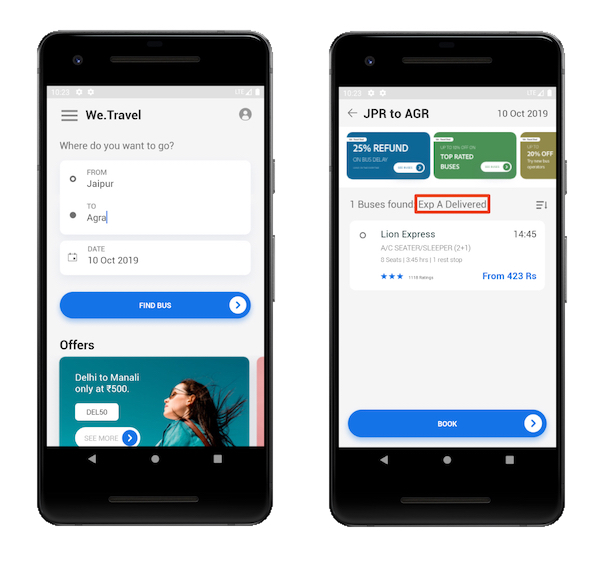
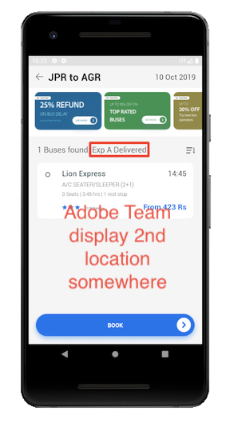

# Adobe Target Location Request Scenarios
The Adobe Mobile Services SDK provides Adobe Target methods & functionality that enable you customize your mobile app experiences.


#### We.Travel App
This article discusses multiple scenarios using a sample travel app. The app has a search feature that finds available bus routes. The app will be used for demonstration purposes.

* Target locations are prefetched on the home screen, so no Target content appears, but locations are cached in the device behind the scene
* The search results screen loads a Target location and displays a text result from the Target server.

 
 
## Use a Prefetch "Blocking" Request
Configuring Target methods as prefetch "blocking" requests provides two main benefits:

* The prefetch method call Target in the "background". It caches locations (mboxes) in device memory for quick access later in the session. This avoids excessive requests to the server & results in a faster app experience.
* A "Blocking" request enables Target content to load into the app before other app content is loaded.

In the code examples below, the changes were made to the main activity of the We.Travel app. The result is an app launch with Target prefetching before any other content loads.

A prefetch blocking request can be set up in an Android Activity by moving the app's content layout methods from the onCreate() method to a separate method that Target calls after a location request.

#### Code Example:  Move app layout logic to a new method
```
// Move the setContentView() method (and other app layout logic) from 
// onCreate() into a new setUp() function:

private void setUp() {
	setContentView(R.layout.activity_home);
	
	// add other logic for app setup 
}
```

#### Code Example:  Call setUp() AFTER Target callback  

```
// Add a call to setUp() at the end of the Target location or prefetch call. 
// This example loads a prefetch request and then calls setUp():

public void targetPrefetchContent() {
	List<TargetPrefetchObject> prefetchList = new ArrayList<>();
	Map<String, Object> profileParameters;
	profileParameters = new HashMap<String, Object>();
	profileParameters.put("ProfileParam8Aug", "25");
	Map<String, Object> mboxParameters1 = new HashMap<String, Object>();
	mboxParameters1.put("MboxParam8Aug", "1");
	prefetchList.add(Target.createTargetPrefetchObject("mboxTest", mboxParameters1));
	Target.TargetCallback<Boolean> prefetchStatusCallback = new 	Target.TargetCallback<Boolean>() {
        @Override
        public void call(final Boolean status) {
            HomeActivity.this.runOnUiThread(new Runnable() {
                @Override
                public void run() {
                    String cachingStatus = status ? "YES" : "NO";
                    System.out.println("Received Response from prefetch : " + cachingStatus);
                    setUp();
                }
            });
        }};
    Target.prefetchContent(prefetchList, profileParameters, prefetchStatusCallback);
}
```

## Use a Live Location Request
On the bus results screen, if we wanted to display an offer related to the bus destination, a live location request should be called for that offer instead of a prefetched location. This is because the offer needs to be changed depending on where the user wants to travel to. Prefetched locations could be used with other elements on the screen not related to the destination (like general discounts or promotions). 

#### Code Example
A live location request is called with the **Target.loadRequest()** method:

```
private void targetLoadRequest() {
    Target.loadRequest("mboxTest", "TargetPreviewMboxTest_defaultContent", null, null, null, new Target.TargetCallback<String>() {
        @Override
        public void call(final String s) {
            runOnUiThread(new Runnable() {
                @Override
                public void run() {
                    System.out.println("Loaded content :" + s);
                    runOnUiThread(new Runnable() {
                        @Override
                        public void run() {
                            tvBusFound.setText(tvBusFound.getText().toString() + ": " + s);
                        }
                    });
                }
            });
        }
    });
}

```


## Request Multiple Target Locations in one Call 
To display multiple offers on the Bus Results Screen, multiple target locations can be requested in a single call:

* Create a TargetRequestObject for each location
* Add each TargetRequestObject to an Array
* Add the Array to the **Target.loadRequests()** method and call the locations
 
#### Code Example
Here is an example from the Bus Results activity. The code is called from the activity's onResume() method:

```
private void targetLoadRequests() {

// Create Multiple Target Location Requests & send in one loadRequests() call

// 1st Location
TargetRequestObject request1 = Target.createTargetRequestObject("mboxTest", "TargetPreviewMboxTest_defaultContent", null, new Target.TargetCallback<String>() {
    @Override
    public void call(final String s) {
        runOnUiThread(new Runnable() {
            @Override
            public void run() {
                System.out.println("Loaded content :" + s);
                runOnUiThread(new Runnable() {
                    @Override
                    public void run() {
                        tvBusFound.setText(tvBusFound.getText().toString() + ": " + s);
                    }
                });
            }
        });
    }
});

// 2nd Location
TargetRequestObject request2 = Target.createTargetRequestObject("mboxTest2", "TargetPreviewMboxTest_defaultContent2", null, new Target.TargetCallback<String>() {
    @Override
    public void call(final String s) {
        runOnUiThread(new Runnable() {
            @Override
            public void run() {
                System.out.println("Loaded content :" + s);
                runOnUiThread(new Runnable() {
                    @Override
                    public void run() {
                        tvBusFound.setText(tvBusFound.getText().toString() + ": " + s);
                    }
                });
            }
        });
    }
});

// Create Array of both requests
List<TargetRequestObject> locationRequests = new ArrayList<>();
    locationRequests.add(request1);
    locationRequests.add(request2);

// Send Location Requests
Target.loadRequests(locationRequests, null);

}

```

#### Result:
2 Target locations are displayed on the screen:




## Combining Prefetch & Live Location Requests
The scenario above (Request Multiple Target Locations in one Call) also demonstrates how to request a prefetched location ("mboxTest" was prefetched on the home screen) and a live location request from the server, both in a single call. This can be done with the **Target.loadRequests()** method.

>Nimit, Vinay,
>
>For the prefetch location & live location scenario - my understanding is that
>there are two pieces to it:
>
>* 1) There is a way to request a live location & prefetch/cache a location in the
>same call.  I see a way with the Target REST API but I’m not finding a way with 
>the Java library. It can easily be done with 2 separate calls.
>* 2) The loadRequests() method can pull content for both live locations & cached 
>locations in one call.
>
>I assume you’re interested in just #2… not so much #1.  Is that correct?  If we
>need to include #1 into the docs, please let me know.

## Clearing Prefetched Locations from Cache
Suppose a special add-on offer was prefetched and cached on the booking > seating screen. A user may revisit that screen later. However, if the user decides to change the bus line during the app session, the prefetched offer should be cleared so a new offer for the new bus line can display. All prefetched locations are cleared with the **Target.clearPrefetchCache()** method.
