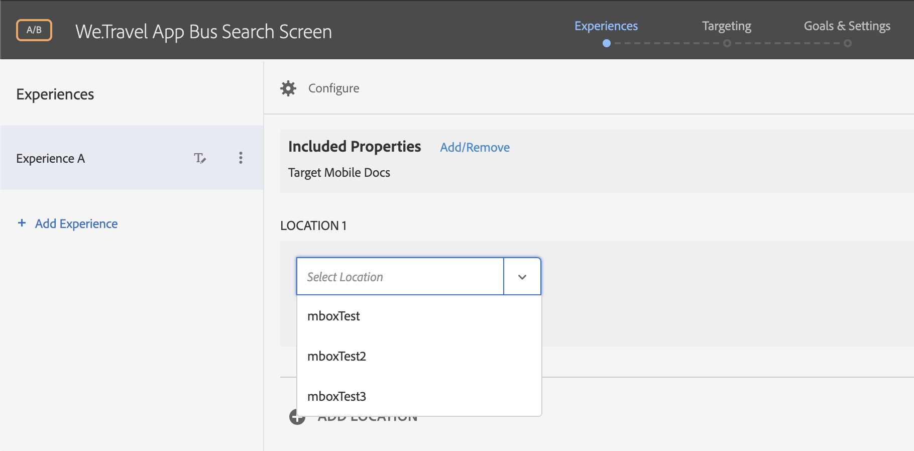
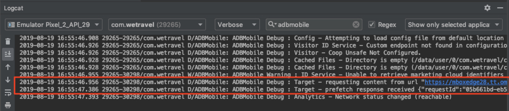

# How to Validate Adobe Target (v4) for your mobile app{#how-to-validate-Adobe-Target-for-your-mobile-app}

The Adobe Target SDK version 4 can be validated on your mobile app by using an Android Emulator & reviewing verbose logging in your Android IDE environment. This article demonstrates how to use the Android Studio IDE to debug Target server calls.  

## Validate with an Emulator

Android Studio's Android Emulator & Logcat feature can be used to validate requests & responses from the Adobe Target servers. If you're using a different IDE such as Eclipse, logging should follow a similar process. You can also import your Android app into Android Studio to use the Logcat feature.  

#### Verify the SDK Implementation
Before debugging server requests, make sure the following steps are complete:

* Download and add the [Adobe Mobile Services SDK](https://docs.adobe.com/content/help/en/mobile-services/android/getting-started-android/requirements.html) to your project
* Add the ADBMobileConfig.json file to the assets folder in your project
* Verify that that ADBMobileConfig.json file has the target.clientCode value set to the correct value for your implementation
* Verify that the correct [Target Classes & Methods](https://docs.adobe.com/content/help/en/mobile-services/android/target-android/c-target-methods.html) are implemented with the correct Target location names (mboxes) 

#### Verify the Target Activity in the UI
If an Activity is already created in the Target UI, the location requested in the Target SDK call (if successful) can be seen in the location drop-down menu under Activities > (Select Activity Name) > Edit Activity > Experiences:

If an Activity is not yet created, create a new one:

* Select Activities > Create Activity
* Select the Activity Type (such as A/B Test)
* Select Mobile App
* Select "Form" as the Experience Composer
* Select the Workspace & Property
* The location drop-down on a selected Experience shows the locations that are registered:

 

#### Debug Requests & Responses with Logcat 
* In Android Studio, select the Logcat console (View > Tool Windows > Logcat OR select the Logcat tab @ the bottom of the screen)
* On the Logcat filter bar, select "Verbose" and set the filter keyword to "adbmobile" (note: if the filter menu doesn't show, try setting the console to a floating window: Window > Active Tool Window > Floating Mode)
* Run the Android Emulator and look for the Target request and response. "Response received" indicates that the server connection and response was successful:

  
 
* Remove the "adbmobile" filter and note any connection errors. Most errors are likely caused from incorrect request syntax or configuration. Proxy settings in the Emulator settings can also cause connection errors.  

#### prefetchContent() Code Example
The Target.prefetchContent() Java method was used to prefetch & cache an mbox in the request shown above. Here is the syntax of the request:

```
@Override
protected void onResume() {
    super.onResume();
    targetPrefetchContent();
}

public void targetPrefetchContent() {
    List<TargetPrefetchObject> prefetchList = new ArrayList<>();
    Map<String, Object> profileParameters;
    profileParameters = new HashMap<>();
    profileParameters.put("ProfileParam8Aug", "25");
    Map<String, Object> mboxParameters1 = new HashMap<>();
    mboxParameters1.put("MboxParam8Aug", "1");
    prefetchList.add(Target.createTargetPrefetchObject("mboxTest", mboxParameters1));
    Target.TargetCallback<Boolean> prefetchStatusCallback = new Target.TargetCallback<Boolean>() {
        @Override
        public void call(final Boolean status) {
            HomeActivity.this.runOnUiThread(new Runnable() {
                @Override
                public void run() {
                    String cachingStatus = status ? "YES" : "NO";
                    System.out.println("Received Response from prefetch : " + cachingStatus);
                }
            });
        }};
    Target.prefetchContent(prefetchList, profileParameters, prefetchStatusCallback);
}
```

#### Response Details Example
Here are the details of the response from the Logcat console (expanded JSON view for readability): 

```
2019-08-19 16:55:47.386 29265-30298/com.wetravel D/ADBMobile: ADBMobile Debug : Target - prefetch response received 
{
  "requestId":"05b661bd-eb54-4aa2-9de9-12cd864d5163",
  "client":"ecserverside",
  "id": {
      "tntId":"111565276712980-418083.28_30",
      "marketingCloudVisitorId":"67393569472874901536515185272210980681"
  },
  "edgeHost":"mboxedge28.tt.omtrdc.net",
  "contentAsJson":false,
  "prefetchResponses":[{
      "mbox":"mboxTest",
      "parameters":{
          "a.ltv.amount":"0",
          "MboxParam8Aug":"1"
      },
      "content":"Exp A Delivered",
      "eventTokens":["A\/KLCCm2LG02ot3KSRSPyWqipfsIHvVzTQxHolz2IpSCnQ9Y9OaLL2gsdrWQTvE5wM++BveH6AIK0pfQ2QUzsg=="]}
  ]}
```
The main key/value pairs to validate and check for accuracy are listed below:

| Key | Value |
|--- |--- |
| client | your Adobe Target clientCode value - unique to your environment  |
| tntId | primary identifier in Target for an individual user |
| prefetchResponses | for prefetch requests: this object list locations (mboxes) that are prefetched and cached into device memory and any profile parameters included in the request |
| mbox | the location identifier used in Activities in Adobe Target  |
| content | for prefetch requests:  content delivered to the specified mbox |

