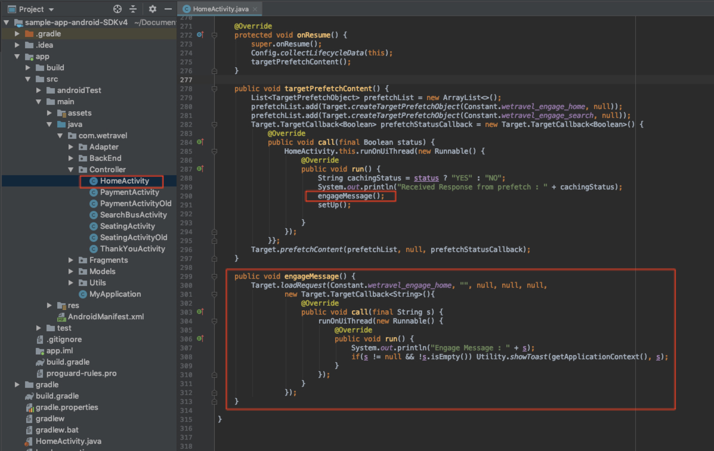
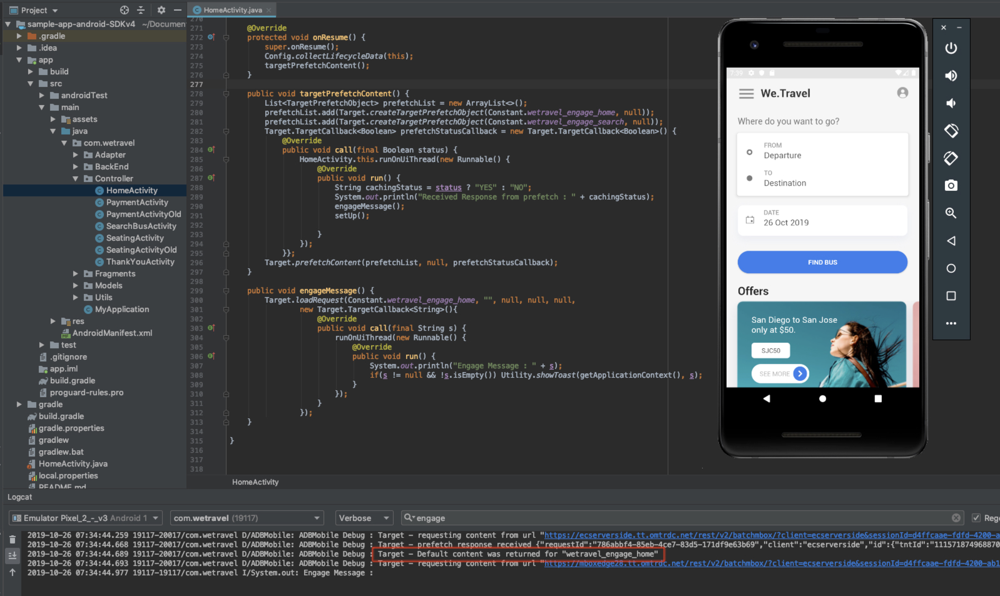
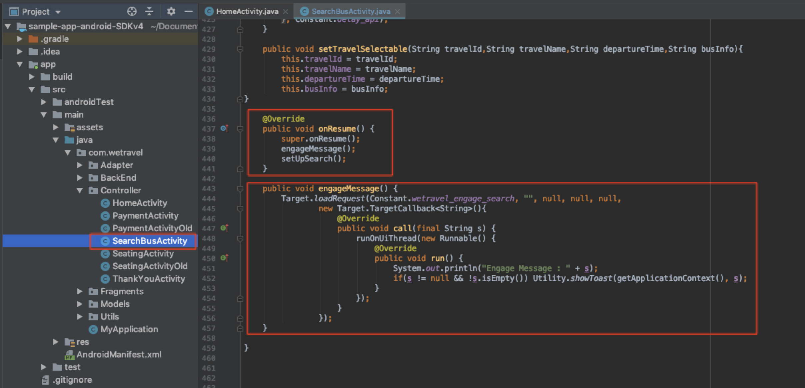
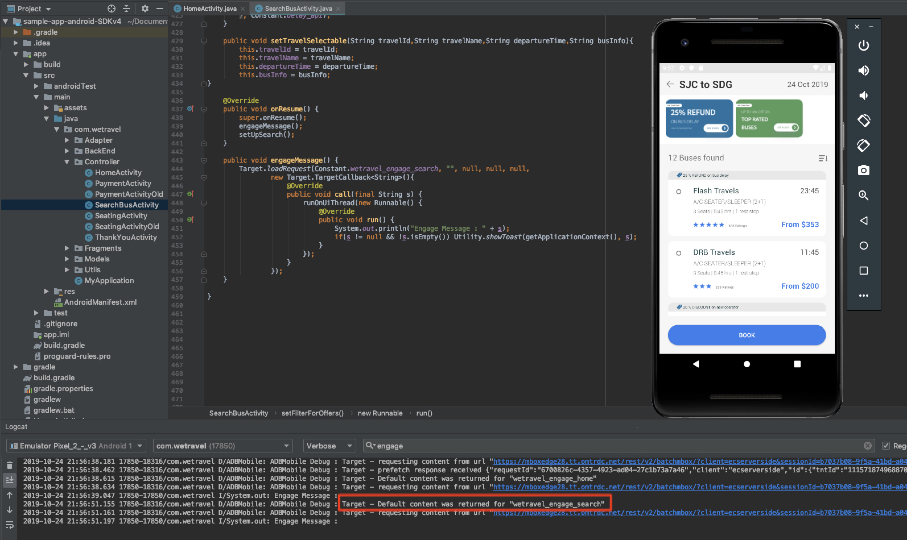

# Personalize Layouts

## Learning Objectives

At the end of this lesson, you will be able to:

* **objective 1**
* **objective 2**

## Create Activities

## Loading Location Placeholders

In the previous lessons, we built a prefetch request to cache two locations (wetravel_engage_home & wetravel_engage_search. Now we'll load the two locations to act as placeholders for our future offers so the offers can be displayed on the screen. The first location will load on the home screen and the second will load on the Search Results screen.

## Load the First Location on the Home Screen

 The first location (wetravel_engage_home) will be displayed on the home screen. Before adding an offer here, let's load the location to the screen and validate it.



Add the engageMessage() function to the targetPrefetchContent() function as shown above. Add the code below at the end of the file as shown above:

```java
public void engageMessage() {
    Target.loadRequest(Constant.wetravel_engage_home, "", null, null, null,
            new Target.TargetCallback<String>(){
                @Override
                public void call(final String s) {
                    runOnUiThread(new Runnable() {
                        @Override
                        public void run() {
                            System.out.println("Engage Message : " + s);
                            if(s != null && !s.isEmpty()) Utility.showToast(getApplicationContext(), s);
                        }
                    });
                }
            });
}
```

### Code Explanation

| Code | Description |
|--- |--- |
| engageMessage() | This function fires Target.loadRequest() which loads the wetravel\_engage\_home location |
Notice that no parameters are needed for the prefetch request or load request. This is because the data that we'll use later for our audience segments is provided by the lifecycle metrics.

## Validate the First Location

Now let's make sure the Location is loading correctly. Open the emulator and load the home screen. The offer you created in the previous lesson should appear as a notification at the bottom of the screen.

You can also open logcat and filter for "engage" to see how the response looks. It should read "Default content was returned for "wetravel_engage_home":



If you are not seeing a successful response, verify settings in the ADBMobileConfig.json file and code syntax in the HomeActivity file.

Once you've finished validating, the wetravel_engage_home location is now ready to display an offer.

## Load the Second Location on the Search Results Screen

Now we'll load the second Location from cache on the Search Results Screen. We'll add the code blocks in red to the SearchBusActivity file:



Scroll down to the end of the SearchBusActivity file and add the code below after the setTravelSelectable() function:

```java
@Override
public void onResume() {
    super.onResume();
    engageMessage();
}

public void engageMessage() {
    Target.loadRequest(Constant.wetravel_engage_search, "", null, null, null,
            new Target.TargetCallback<String>(){
                @Override
                public void call(final String s) {
                    runOnUiThread(new Runnable() {
                        @Override
                        public void run() {
                            System.out.println("Engage Message : " + s);
                            if(s != null && !s.isEmpty()) Utility.showToast(getApplicationContext(), s);
                        }
                    });
                }
            });
}
```

Notice that no extra parameters are used for this load request. The lifecycle metrics will provide the data we need for audience segments in Target (covered in the next lesson).

# Validate the Second Location

With the Emulator, select a departure & destination on the Home Screen and tap "Find Bus". Watch Logcat for the Target response when the Search Results Screen renders:



* The "wetravel\_engage\_search" response should read "Default content was returned for "wetravel\_engage\_search" (default content is returned since this is the first request to the server & there is no offer content configured yet).

If you are not seeing success responses, verify settings in the ADBMobileConfig.json file and code syntax in the SearchBusActivity file.

Once you've finished validating, the wetravel_engage_search location is now ready to display an offer.

# Validate the Third Location
